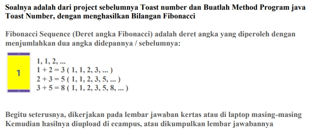

Nama : Rafif Isdarufa Athallah

NIM : 312210299

Kelas : TI.22.A3

---

## Soal UTS



## Java

```java
package com.hellotoast;

import android.os.Bundle;
import android.view.View;
import android.widget.EditText;
import android.widget.TextView;
import android.widget.Toast;

import androidx.appcompat.app.AppCompatActivity;

public class MainToast extends AppCompatActivity {
    private TextView showCount;
    private int count = 0;
    private long fibNMinus1 = 1;
    private long fibNMinus2 = 0;
    private EditText edit_max_fibonacci;

    @Override
    protected void onCreate(Bundle savedInstanceState) {
        super.onCreate(savedInstanceState);
        setContentView(R.layout.activity_toast);

        showCount = findViewById(R.id.show_count);
        edit_max_fibonacci = findViewById(R.id.edit_max_fibonacci);

        updateCountDisplay();

        fibNMinus1 = 0;
        fibNMinus2 = 1;
    }

    private void updateCountDisplay() {
        showCount.setText(String.valueOf(fibNMinus2));

        if (count % 4 == 0) {
            showCount.setTextColor(getResources().getColor(R.color.colorPrimary));
        } else if (count % 4 == 1) {
            showCount.setTextColor(getResources().getColor(R.color.colorAccent));
        } else if (count % 4 == 2) {
            showCount.setTextColor(getResources().getColor(R.color.colorPrimary));
        } else {
            showCount.setTextColor(getResources().getColor(R.color.colorAccent));
        }
    }

    public void showToast(View view){
        Toast.makeText(this, "Bilangan Fibonacci",
                Toast.LENGTH_SHORT).show();
    }

    public void countUp(View view) {
        int maxFibonacci = Integer.parseInt(edit_max_fibonacci.getText().toString());

        if (count >= maxFibonacci) {
            Toast.makeText(this, "Maksimum Fibonacci tercapai", Toast.LENGTH_SHORT).show();
            return;
        }

        long fibCurrent;
        if (count == 0) {
            fibCurrent = 1;
        } else {
            fibCurrent = fibNMinus1 + fibNMinus2;
        }

        fibNMinus2 = fibNMinus1;
        fibNMinus1 = fibCurrent;
        updateCountDisplay();

        count++;
    }

    public void back1(View view) {
        count = 1;
        fibNMinus1 = 1;
        fibNMinus2 = 0;
        updateCountDisplay();
    }
}
```

## Penjelasan

### Package

```java
package com.hellotoast;

import android.os.Bundle;
import android.view.View;
import android.widget.EditText;
import android.widget.TextView;
import android.widget.Toast;

import androidx.appcompat.app.AppCompatActivity;
```

- *Package* dalam Java adalah cara untuk mengatur dan mengelompokkan kelas-kelas dalam program. Disini kita menggunakan *package* `com.hellotoast`, semua kelas di dalamnya akan memiliki nama yang sama.

- Kemudian *import* digunakan untuk mengimpor kelas-kelas dan pustaka yang dibutuhkan dari paket lain. Misalnya, kelas **Bundle, View, EditText, TextView,** dan **Toast** diimpor dari paket Android untuk digunakan dalam kelas ini. **AppCompatActivity** diimpor dari paket androidx.appcompat untuk memanfaatkan fungsionalitas aktivitas aplikasi yang kompatibel dengan versi Android sebelumnya.

---

###  Class: MainToast

```java
public class MainToast extends AppCompatActivity {
    private TextView showCount;
    private int count = 0;
    private long fibNMinus1 = 1;
    private long fibNMinus2 = 0;
    private EditText edit_max_fibonacci;
```

- `MainToast` adalah kelas utama dari program. Ini meng-*extends* **AppCompatActivity**, yang berarti bahwa kelas ini adalah turunan dari kelas **AppCompatActivity** yang merupakan bagian dari Android SDK.

- Kemudian jika suatu variabel atau metode dideklarasikan sebagai *private*, itu berarti bahwa elemen tersebut hanya dapat diakses atau digunakan di dalam kelas yang sama di mana itu dideklarasikan. Ini menciptakan tingkat privasi yang tinggi, dan elemen tersebut tidak dapat diakses dari luar kelas tersebut.

- `private TextView showCount`: Variabel ini digunakan untuk mereferensikan sebuah objek **TextView** yang digunakan untuk menampilkan suatu nilai atau teks di antarmuka pengguna.

- `private int count = 0`: Variabel ini menyimpan nilai bilangan bulat *(integer)* dan diinisialisasi dengan nilai 0.

- `private long fibNMinus1 = 1`: Variabel ini menyimpan nilai bilangan bulat yang lebih besar (long) dan diinisialisasi dengan nilai 1.

- `private long fibNMinus2 = 0`: Variabel ini juga menyimpan nilai bilangan bulat yang lebih besar (long) dan diinisialisasi dengan nilai 0.

- `private EditText edit_max_fibonacci`: Variabel ini digunakan untuk mereferensikan objek EditText yang dapat digunakan untuk memasukkan atau mengedit teks. Digunakan untuk memasukkan nilai maksimum dalam perhitungan bilangan *Fibonacci*.

---

### Method: onCreate()

```java
@Override
protected void onCreate(Bundle savedInstanceState) {
    super.onCreate(savedInstanceState);
    setContentView(R.layout.activity_toast);

    showCount = findViewById(R.id.show_count);
    edit_max_fibonacci = findViewById(R.id.edit_max_fibonacci);

    updateCountDisplay();

    fibNMinus1 = 0;
    fibNMinus2 = 1;
}
```

- `onCreate` adalah metode yang dipanggil ketika aktivitas (activity) dibuat. Di sini, layout ditetapkan menggunakan **setContentView**, dan objek-objek UI seperti **showCount** dan **edit_max_fibonacci** diinisialisasi.
- Metode `updateCountDisplay()` dipanggil untuk memperbarui tampilan bilangan *Fibonacci* awal.

---

### Method: updateCountDisplay()

```java
private void updateCountDisplay() {
        showCount.setText(String.valueOf(fibNMinus2));

        if (count % 4 == 0) {
            showCount.setTextColor(getResources().getColor(R.color.colorPrimary));
        } else if (count % 4 == 1) {
            showCount.setTextColor(getResources().getColor(R.color.colorAccent));
        } else if (count % 4 == 2) {
            showCount.setTextColor(getResources().getColor(R.color.colorPrimary));
        } else {
            showCount.setTextColor(getResources().getColor(R.color.colorAccent));
        }
    }
```

- Metode ini mengupdate tampilan bilangan *Fibonacci* pada **showCount** dan mengupdate tampilan jumlah dengan nilai `fibNMinus2`.
- Jika nilai `count` dibagi 4 menghasilkan sisa 0, warna teks akan diatur menjadi warna dasar *(colorPrimary)*. Jika sisa adalah 1, warna teks akan diubah menjadi warna aksen *(colorAccent)*. Jika sisa adalah 2, warna teks akan kembali ke warna dasar. Untuk sisa lainnya, warna teks akan menjadi warna aksen.

---

### Method: showToast()

```java
public void showToast(View view){
        Toast.makeText(this, "Bilangan Fibonacci",
                Toast.LENGTH_SHORT).show();
    }
```

-  Metode ini menampilkan pop-up dengan pesan "Bilangan Fibonacci" selama beberapa detik. Ini berguna untuk memberi tahu pengguna atau memberikan umpan balik singkat dalam aplikasi.
- Metode ini akan dijalankan jika pengguna mengklik tombol **Toast** yang tersedia.

---

### Method: countUp()

```java
public void countUp(View view) {
        int maxFibonacci = Integer.parseInt(edit_max_fibonacci.getText().toString());

        if (count >= maxFibonacci) {
            Toast.makeText(this, "Maksimum Fibonacci tercapai", Toast.LENGTH_SHORT).show();
            return;
        }

        long fibCurrent;
        if (count == 0) {
            fibCurrent = 1;
        } else {
            fibCurrent = fibNMinus1 + fibNMinus2;
        }

        fibNMinus2 = fibNMinus1;
        fibNMinus1 = fibCurrent;
        updateCountDisplay();

        count++;
    }
```

- Fungsi `countUp` ini digunakan untuk menghitung dan menampilkan urutan angka *Fibonacci*.
- Pertama, program mengambil nilai maksimum *Fibonacci* dari input pengguna. Jika sudah mencapai atau melebihi batas ini, akan muncul pesan pemberitahuan.
- Selanjutnya, fungsi menghitung nilai *Fibonacci* saat ini berdasarkan dua nilai sebelumnya (**fibNMinus1** dan **fibNMinus2**). Kemudian, nilai-nilai tersebut diperbarui, tampilan hitungan juga diperbarui dan nilai hitungan juga ditambah satu.

---

### Method: back1()

```java
public void back1(View view) {
    count = 1;
    fibNMinus1 = 1;
    fibNMinus2 = 0;
    updateCountDisplay();
}
```

- Metode ini mengatur bilangan *Fibonacci* ke nilai awal dan memperbarui tampilan saat tombol `Back` ditekan. 
- Ketika ini terjadi, variabel **count** diatur menjadi 1, dan dua variabel lainnya, yaitu **fibNMinus1** dan **fibNMinus2**, diatur menjadi 1 dan 0.
- Selanjutnya, fungsi `updateCountDisplay()` dipanggil untuk memperbarui tampilan dengan nilai-nilai yang baru diatur.

---

## Output


---

## Sekian, terimakasih.